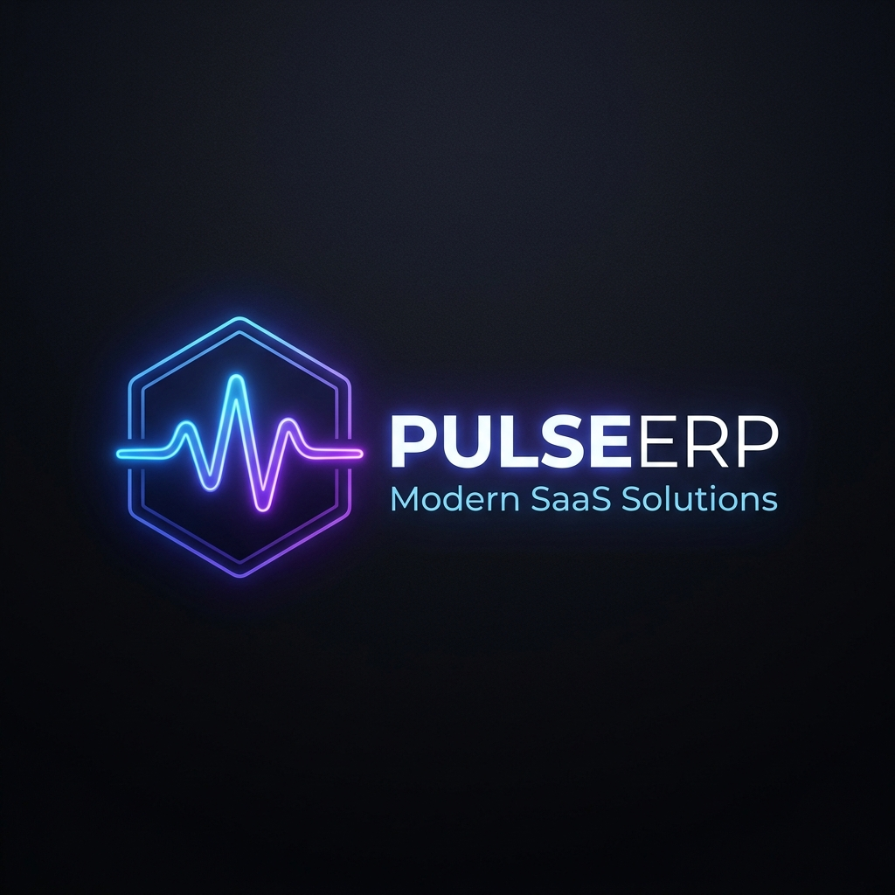
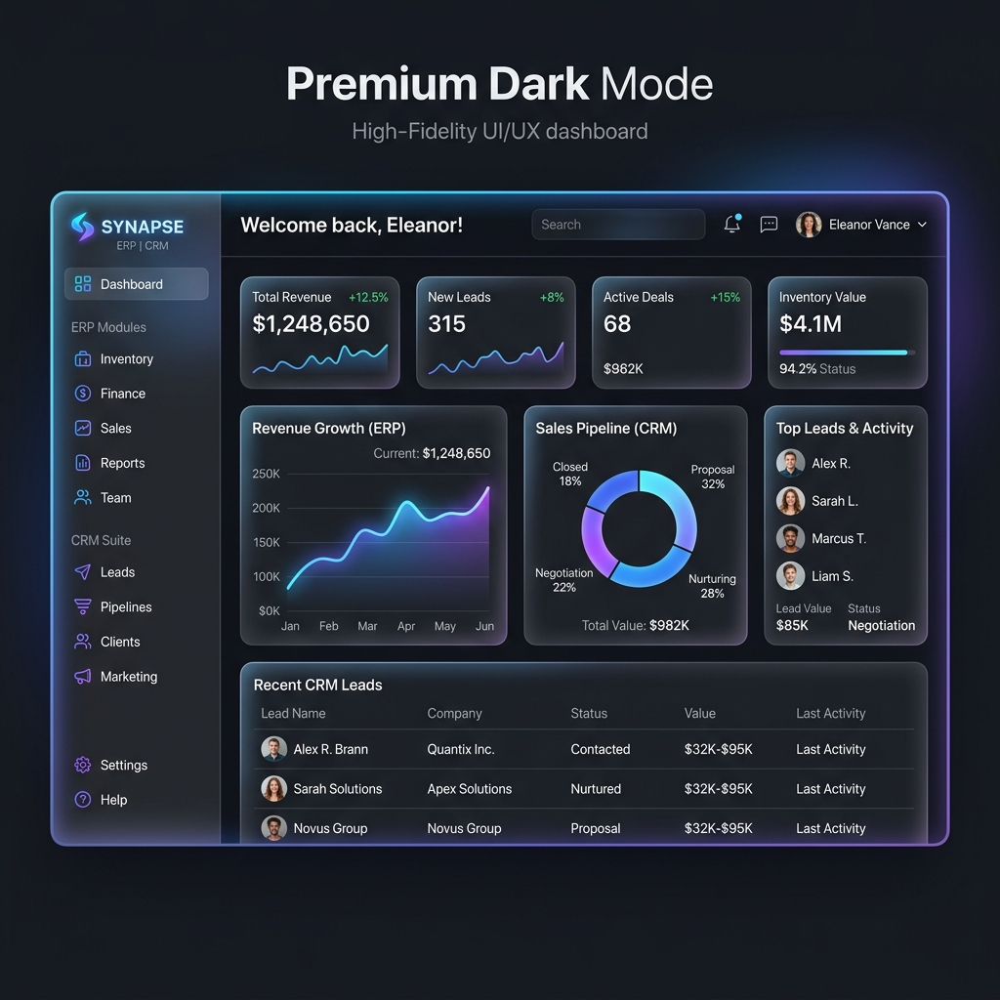
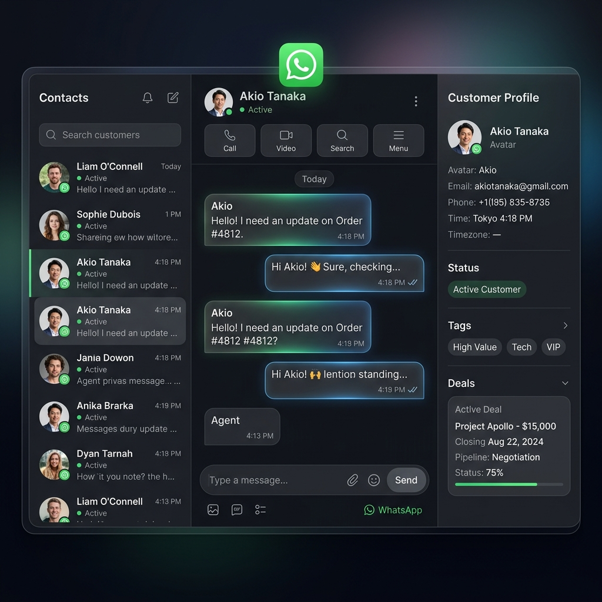

  

  # PulseERP
  ### O Único Sistema que a sua Startup Precisa.

  

    Plataforma Omnichannel White-label de CRM, ERP e Automação de próxima geração.
  

  

    
    
    
    
  

---

## 🚀 Visão Geral

O **PulseERP** é mais que um projeto de código: é um produto SaaS "pronto para escalar". Ele unifica o gerenciamento de relacionamento com clientes (CRM), finanças (ERP) e atendimento (WhatsApp Omnichannel) em um painel *premium*, moderno e focado na conversão.

Desenvolvido para agências, startups e empresas que desejam uma solução corporativa completa com arquitetura multi-tenant, sendo perfeito também para o modelo **White-Label**.

---

## ✨ Interface Premium (Dark Mode)

A identidade visual foi pensada para impressionar, combinando tons escuros, glassmorphism e cores neon suaves que passam credibilidade, foco e tecnologia de ponta.

### Dashboard Analítico

### Atendimento Omnichannel (WhatsApp Webhook)

---

## 💎 Diferenciais do Produto (Features)

- **🏢 Multi-tenant Nativo:** Isolamento completo de dados (Tenant ID). Ideal para franquias ou revenda SaaS (White-label).
- **📱 Integração WhatsApp (Meta API):** Receba, gerencie e responda mensagens de múltiplos clientes no mesmo painel.
- **⚡ Tempo Real (WebSocket):** Atualizações instantâneas no kanban, notificações e chat com Socket.io e Redis.
- **🔒 Autenticação Completa:** Segurança de ponta com JWT, Bcrypt e arquitetura RBAC (Role-based Access Control).
- **🎨 Design System Premium:** Tailwind CSS v4 + shadcn/ui criando uma experiência visual sem igual.

---

## 🏗 Arquitetura & Stack

O repositório é construído para alta performance e escalabilidade em nuvem.

### Backend (API)
- **Framework:** NestJS
- **Banco de Dados:** PostgreSQL via Prisma ORM
- **Cache & Eventos:** Redis
- **Tempo Real:** Socket.io

### Frontend (Web)
- **Framework:** Next.js 15 (App Router)
- **Estilização:** Tailwind CSS v4, shadcn/ui
- **Auth Integrado:** Supabase Auth + Integração nativa com API

---

## 🗺 Roadmap "Startup Ready"

- [x] **Etapa 1:** Aparência Profissional (Logo, Screenshots, UI/UX Premium, Landing Page Vendedora).
- [ ] **Etapa 2:** Estrutura SaaS (Billing/Assinaturas, Gestão avançada de Tenants, Onboarding).
- [ ] **Etapa 3:** Automação e IA (Chatbots WhatsApp com IA, Fluxos de Cadência, Disparos em massa).

---

## ⚙️ Como Começar (Guia para Desenvolvedores)

A documentação de setup local (Docker, Variáveis de Ambiente, Migrations) foi movida para manter esta página focada no produto comercial.

👉 **[Acesse o Guia de Instalação e Deploy](./docs/SETUP.md)**

---

  
Feito para escalar o seu negócio. 🚀

