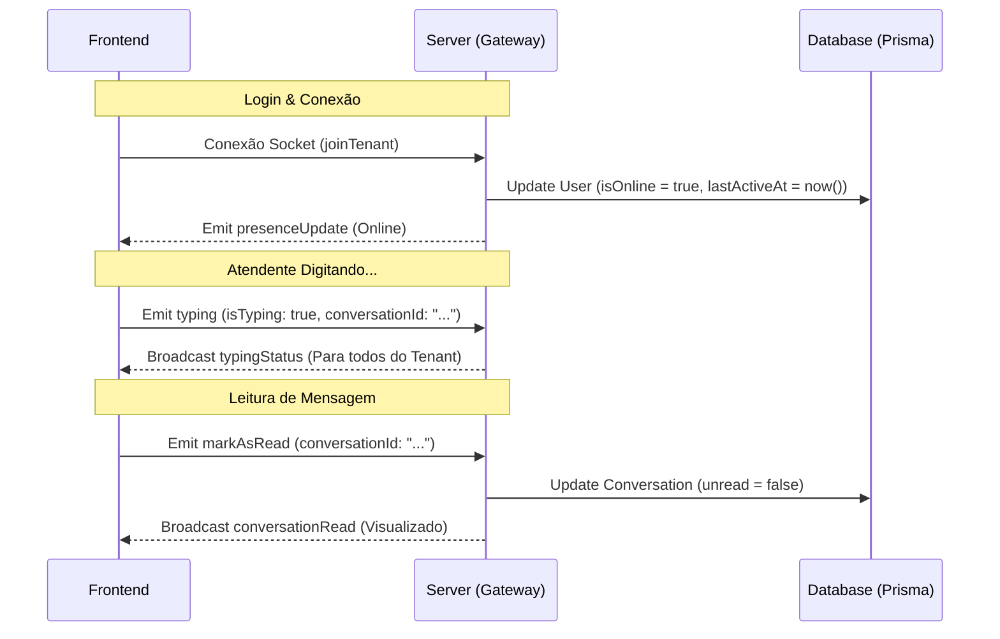

# Especificação Técnica: Inbox Omnichannel Premium & Presence System
**Autor:** Antigravity (Google DeepMind)
**Data:** 2026-05-17
**Status:** Aprovado para Implementação

---

## 1. Visão Geral
Esta especificação descreve a arquitetura do **Subprojeto 1: Inbox Omnichannel Premium & Presence System**. O objetivo é transformar o inbox do PulseERP em um hub altamente interativo, reativo e extensível no estilo Intercom, Slack e Discord, implementando suporte a mensagens ricas (áudio com waveforms, reações com emojis, citação/reply) e um sistema de presença e atividade contínua dos atendentes em tempo real.

---

## 2. Arquitetura do Motor de Canais (`/channels`)
Adotaremos o **Strategy Pattern** para padronizar e isolar a integração com canais de mensageria terceiros, eliminando acoplamento e garantindo extensibilidade infinita.

### Estrutura de Diretórios
```text
server/src/channels/
├── channel-provider.interface.ts  # Contrato/Interface unificada
├── channels.registry.ts           # Registro de resolvedores de canais
├── channels.module.ts             # Módulo centralizado de canais
│
├── whatsapp/                      # Provedor do WhatsApp Híbrido (Oficial/Não-Oficial)
│   ├── whatsapp-channel.service.ts
│   ├── whatsapp-channel.controller.ts
│   └── whatsapp-channel.module.ts
│
├── instagram/                     # Provedor Instagram (DM Meta)
│   ├── instagram-channel.service.ts
│   └── instagram-channel.module.ts
│
└── telegram/                      # Provedor Telegram (Bot API)
    ├── telegram-channel.service.ts
    └── telegram-channel.module.ts
```

### Contrato Unificado (`channel-provider.interface.ts`)
```typescript
export interface ChannelProvider {
  sendMessage(
    tenantId: string, 
    destinationId: string, 
    content: string, 
    options?: any
  ): Promise<any>;

  receiveMessage(payload: any): Promise<any>;
  markAsRead(tenantId: string, messageId: string): Promise<any>;
  typing(tenantId: string, contactId: string, isTyping: boolean): Promise<any>;
}
```

---

## 3. Estrutura de Metadados Ricos (Banco de Dados PostgreSQL)
Para evitar migrations complexas e de alto risco na tabela `Message` em produção, utilizaremos o campo flexível `metadata` (`Json?` no PostgreSQL via Prisma) para carregar reações, respostas citadas (reply) e dados adicionais de mídia.

### JSON Schema do Campo `metadata`
```typescript
interface RichMessageMetadata {
  // 1. Mensagens Citadas (Replies / Quoted Messages)
  quotedMessage?: {
    id: string;          // ID da mensagem pai respondida
    content: string;     // Conteúdo de visualização da mensagem respondida
    type: string;        // Tipo: text, image, audio, file
    senderName: string;  // Nome de quem enviou a mensagem respondida
  };

  // 2. Reações de Emojis
  reactions?: Array<{
    senderId: string;    // ID do usuário/atendente ou contato que reagiu
    name: string;        // Nome para exibição amigável
    emoji: string;       // O caractere emoji (ex: "❤️", "👍")
    createdAt: string;   // Timestamp ISO
  }>;

  // 3. Informações de Áudio Waveform e player
  audioDuration?: number; // Duração em segundos (ex: 42.5)
  fileSize?: number;      // Tamanho em bytes
  
  // 4. Informações de Mídia Rica (Imagem/Vídeo)
  width?: number;
  height?: number;
  thumbnailUrl?: string;  // Miniatura leve ou blurhash
}
```

---

## 4. Presence System & WebSockets em Tempo Real
Gerenciaremos a presença e atividade dos atendentes no WebSocket (`ChatGateway`), persistindo o estado atual no banco de dados nas colunas `isOnline` e `lastActiveAt` da tabela `User` para controle gerencial de SLA.

### Eventos WebSocket Padronizados (Socket.io)



---

## 5. UI/UX Otimizada (Frontend)
Para garantir uma experiência extremamente premium idêntica a aplicativos nativos:
*   **Rolagem Virtualizada (`virtualization`)**: Utilização de bibliotecas como `@tanstack/react-virtual` ou `react-window` para renderizar apenas as mensagens visíveis na tela, permitindo conversas com mais de 50.000 mensagens sem travar o navegador.
*   **Scroll Infinito**: Carregamento assíncrono das próximas mensagens do histórico conforme o scroll do usuário atinge o topo do chat, com transições suaves e sem "saltos" visuais.
*   **Players de Áudio Customizados**: Exibição de ondas sonoras (waveform dinâmico em canvas ou CSS flexível) que mudam de cor conforme o áudio é reproduzido, com controle de velocidade (1x, 1.5x, 2x).

---

## 6. Plano de Testes & Critérios de Aceitação
1. **Envio de Reply**: Atendente clica em responder ➡️ Mensagem é exibida no chat aninhada sobre o card da mensagem original ➡️ Salva no banco no campo `metadata`.
2. **Reação por Emoji**: Atendente passa o cursor sobre a mensagem, clica em ❤️ ➡️ Reação é gravada no `metadata`, replicada instantaneamente para todos os atendentes do Tenant via WebSocket, e decrementada/alterada se clicada novamente.
3. **Status de Presença**: Atendente fecha a aba ➡️ Coluna `isOnline` muda para `false` no banco e bolinha verde do avatar fica cinza para os supervisores.
4. **Digitando**: Atendente começa a escrever ➡️ O indicador "Digitando..." aparece no rodapé do chat para os outros atendentes visualizando a mesma conversa.
